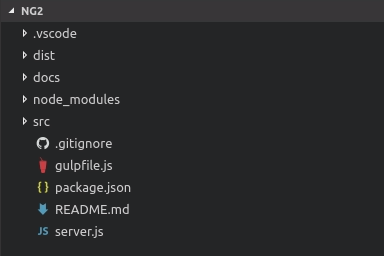
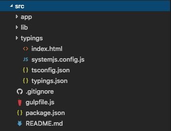
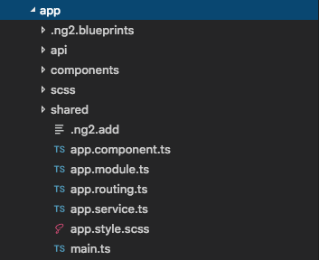

# Angular 2

This is a basic starter project using the following technologies:
- [Angular 2](https://angular.io/)
- [JSPM](https://jspm.io)
- [Gulp](http://gulpjs.com/)
- [Sass](http://sass-lang.com/). 

Clone this repo for any new project you build, rather than always starting from scratch.

## Setup:

- `git clone https://bitbucket.org/blwabona/ng2.git`

You need global Gulp & JSPM:

- `npm install -g gulp jspm`
- `npm install`
- `jspm install`

## Build, Run and other commands

**Note:** The default commands are for **development** and require an additional parameter `--prod` to target production. 

For example, to create the **distribution** build in the `dist` folder, simply append `--prod` to every command (e.g. `gulp build --prod` builds`dist` folder for the production release.

On the other hand, `gulp build` only compiles everything in the **source** or `src` folder).

- `gulp build`
- `gulp dev`

## Project & Build Structure

1. In the `root` directory, we have the following:
    - `src/`: contains source code, config, etc.
    - `node_modules/`: contains all libraries used in this project, whether for the app or development purposes.
    - `gulpfile.js` : contains all tasks for running the project, which will be looked at in more detail later. 
    - `package.json` : contains all dependencies for the project

    

2. In the `src` directory, we have:
    - `app/`: contains all the Angular 2 application 
    - `lib/`: contains all required libraries, copied from `node_modules` in the root.

    

3. In the `src` directory, we have:
    - `api/`: contains all api related files:
        - `api.service.ts`: a wrapper around angular's *Http* service
        - `api.envs.ts` : a file containing values for different environments.
    - `.ng2/`: angular blueprints for components, services, directives, etc.
    - `.ng2.add` : shell script, to quickly generate arbitrary angular 2 files.

    

## How to extend it:

Packages are usually added via [NPM](https://www.npmjs.com/) or [JSPM](http://jspm.io/):

NPM:
- `npm install {packageName} --save`

JSPM:
- `jspm install npm:{packageName}`
- `jspm install github:{packageName}`

Since SystemJS is used for loading modules, the following is required for installed packages:

In `systemjs.config.js` in the root

1. add the npm directory to `map`:
```json
    map: {
        '{packageName}': 'node_modules/{packageName}'
    }
```
2. add it to `packages`:
```json
    packages: {
        '{packageName}' : {
            defaultExtension: 'js',
            main: 'index.js'
        }
    }
```